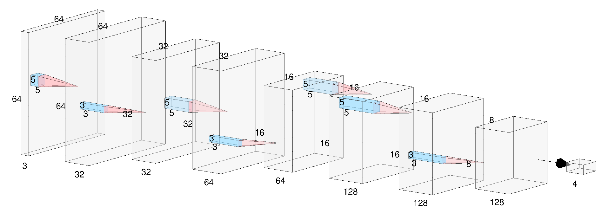
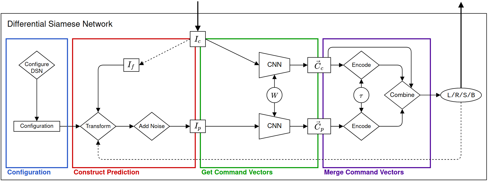

# Differential Siamese Network for the Avoidance of Moving Obstacles
### BSc Computer Science

### Leiden Institute of Advanced Computer Science (LIACS) - 26-08-2020

This repository provides the code and Obstacle-Avoidance (OA) datasets from the BSc Project *Differential Siamese Network for the Avoidance of Moving Obstacles*. The project tackles the problem of avoiding moving obstacles using only a monocular RGB camera. It uses a convolutional neural network (CNN) to retrieve information from the images, where its base architecture is taken from another paper by Khan and Parker ("_Vision based indoor obstacle avoidance using a deep convolutional neural network_"). The architecture is modified slightly, is part of the DSN and also acts as a baseline when evaluating the DSN. Its architecture is visualized below.

This README contains a brief overview of the project and how to run important code. For a more thorough explanation, please read the [thesis](https://theses.liacs.nl/1869). All experiments are conducted in a simulated environment, namely [CoppeliaSim](https://www.coppeliarobotics.com/). This software is required if you want to run any of the code, with the exception of training the CNN. Demos of the DSN and baseline can be viewed [here](https://www.youtube.com/playlist?list=PLlmEThkxGpCoqu7vVWsoISe69vTceq4cO).

___

### Differential Siamese Network
The Differential Siamese Network (DSN) is the main contribution. It tries to predict the current image on the basis of an earlier viewed image. To define which images are used, we denote DSN-_n_, where _n_ indicates how many images the DSN looks in the past. So if we have images _s_, _t_, _v_ and _w_ which occur sequentially (least to most present, _w_ is the current image), then DSN-2 takes image _t_.
The DSN-architecture is visualized below (specifically DSN-1), with all four of its components. Here, the bold arrows are the in- and output of the DSN, while the dotted arrows describe actions which occur after an iteration.

The code to configure the DSN can be found in `/DSN/config_DSN.py`, while the implementation of the DSN itself can be found here `/DSN/DSN.py`.

## Contents

* [Overview of repository](#overview)
* [Usage](#usage)
* [Datasets](#datasets)
* [Citing](#citing)

## Overview of repository <div id="overview"></div>
Here, an overview is given of all included files. **Note that some scripts/code contain absolute/relative paths, so they might not be up to date with the repository. Change the paths manually when necessary. Thereby, some files need to be moved into different directories in order to run, see what files are imported for each python script.**
| Directory    | Description                                                  |
| ------------ | ------------------------------------------------------------ |
| config       | `.ini`-files for configuring the DSN and connecting to CoppeliaSim. |
| coppelia_sim | Self-written CoppeliaSim API and `.lua`-code for robot/objects. Scenes can be downloaded [here](https://drive.google.com/file/d/1qC62AUr2bsROtt4C5UPrfkoCHej2V_5I/view?usp=sharing). |
| datasets     | Classes selected for the OIDv6 subset. OA-datasets can be downloaded [here](https://drive.google.com/file/d/1BsXPcXdQIZSh7mP-PVvkE6y7Gm6AS0jU/view?usp=sharing). |
| DSN          | DSN-class and code to configure the DSN.                     |
| experiments  | Code for the two conducted experiments.                      |
| models       | Baseline-class, all model architectures, code to train the model. Weights can be downloaded [here](https://drive.google.com/file/d/1Taq1sT7tYH_sIUz8TYHRIKJJJs4ABfBI/view?usp=sharing). |

## Usage <div id="usage"></div>
The models are trained on Obstacle Avoidance (OA) images with the classes: Backwards, Left, Right and Straight. The CNN its output is in the same order as mentioned here.

___

### Models
In order to use the baseline model, import `/models/baseline.py` and create a new instance of the Baseline class. Then:
``` python
model = Baseline(CNN_filename)  #create instance of baseline
next_command = model.determine_command(img)
```
Similarly, to use the DSN, import `/DSN/DSN.py` and create a new instance of the DSN class.
```python
model = DSN(CNN_filename, DSN_variant, transformations, tau, resolution)  #create instance of DSN
next_command = model.determine_command(img)
```
Here, `CNN_filename` is the location where the weights are stored and `img` is a numpy array with shape `(1, resolution_y, resolution_x, 3)`. Specifically for the DSN, `DSN_variant` contains _n_, `transformations` describes how every image transformation (zoom/shift) needs to be applied, `tau` is a parameter specific for the Command Vector and at lastly `resolution` denotes the resolution (both X and Y) of the input image.

The weights of the models can be downloaded [here](https://drive.google.com/file/d/1Taq1sT7tYH_sIUz8TYHRIKJJJs4ABfBI/view?usp=sharing). It is also possible to train a fresh CNN with the files in `/models/modified/train_model/`. Here, for every dataset a script is written with which you can train the model from scratch.

___

### Configuring the DSN
But before you can use the DSN, it has to be configured to be able to construct realistic predictions. As earlier mentioned, the file which handles the configuration can be found in `/DSN/config_DSN.py`. Then, an `.ini`-file must be provided which defines the speed of the left and right motor for every command (Backwards, Left, Right, Straight). This file can be found here `/config/commands.ini`. **The order of defining the commands is important, do not change this.**

Now, with the use of a CoppeliaSim API, a small configuration run will be executed and the results will be written to a new `.ini`-file named `DSN.ini`. To run the program, use the following command:
```bash
python3 config_DSN.py [iter] [DSN-variant] [tau]
```
`iter` indicates how many runs will be executed for every command, the higher the number the more accurate it will be. 3 or 5 is sufficient. The configuration makes use of AKAZE for feature point detection.

___

### CoppeliaSim API
An API has been written to connect the DSN/baseline to the CoppeliaSim simulator. This API can be found here: `coppelia_sim/API_coppeliasim.py`. It contains functions for the DSN configuration (`check_startup_sim` and `stop_simulation`), manually closing the connection with the simulator (`exit_API`) and provides and interface with CoppeliaSim. Here is a small example:
```python
CS = CoppeliaSim(address, port)                 #initialize and start the connection
CS.get_handles(motors, sensor)                  #initialize the handles for motors/sensors
while True:
  img = CS.get_image()                          #get image from robot
  #do something with image
  CS.set_velocity(v_left_motor, v_right_motor)  #set velocity for left and right motor
```
Moreover, the API requires three files, namely `remoteAPI.so`, `sim.py` and `simConst.py`, which have to be in the same directory as the API itself. Additionally, `/config/coppelia_sim.ini` contains the information about the address and port, along with the handles for various components of the robot and more. This file needs to be changed according to your own robots and the installment of CoppeliaSim.

At last, `.lua`-code has been provided with which moving obstacles (`/coppelia_sim/scripts/moving_obstacle.lua`) and an OA-dataset (`/coppelia_sim/scripts/pioneer.lua`) can be created.

___

## Datasets <div id="datasets"></div>

The CIFAR-100 dataset is downloaded via Tensorflow.

For the OIDv6-dataset, not all classes are trained upon. Only the classes that are related to an office, urban and/or household environment are selected. See `datasets/overview_OIDv6.csv` for the list of all selected classes, along with some statistics as to how many images are present in the training/validation/test set.

Lastly, the OA-datasets are created in CoppeliaSim using the `.lua` scripts (provided in `coppelia_sim/`). The datasets and scenes can be downloaded from the following links: [datasets](https://drive.google.com/file/d/1BsXPcXdQIZSh7mP-PVvkE6y7Gm6AS0jU/view?usp=sharing) and [scenes](https://drive.google.com/file/d/1qC62AUr2bsROtt4C5UPrfkoCHej2V_5I/view?usp=sharing).

## Citing <div id="citing"></div>

In case you want to use the code and/or OA-datasets in your own work, please view this [website](https://theses.liacs.nl/1869) for the citation details.

